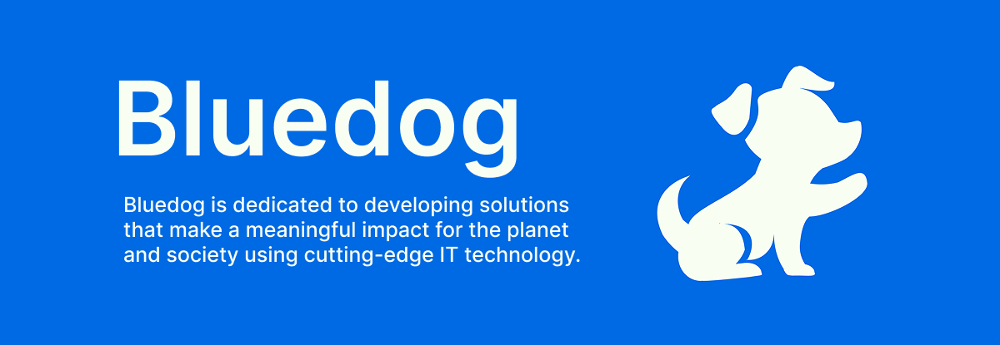

  
  
  # 🌏 Welcome to Bluedog
  
  
  
  

  *Building software for a better tomorrow*

## 👋 About Me

I'm Fumiya and a freelance software engineer passionate about leveraging technology to address environmental and social challenges. Through [bluedoghub.com](https://bluedoghub.com), I seek innovative solutions that contribute to a more sustainable future.

## 🚀 Featured Projects

### 📱 Littera
Provides a range of functions to help you effectively clean up litter in your area and stay motivated to keep the streets clean.
- Beta Version is Available

## 📚 Featured Repositories

### 🐶 Littera - Community-Powered Litter Reporting Platform

| Repository | Description | Status | Tech Stack |
|------------|-------------|---------|------------|
| 🔒 [Mobile](https://github.com/fmyaaaaaaa/littera-mobile) | Cross-platform mobile client |  |   |
| 🔒 [Server](https://github.com/fmyaaaaaaa/littera-server) | Backend API and services |  |    |
| 🔒 [Infra](https://github.com/fmyaaaaaaa/littera-infra) | Infrastructure as Code |  |   |

### 🐶 Bluedoghub.com - Company webpage
| Repository | Description | Status | Tech Stack |
|------------|-------------|---------|------------|
| [Web](https://github.com/fmyaaaaaaa/bluedoghub.com) | Bluedoghub official website |  |   |

## 💻 Tech Stack

### Frontend Development

### Backend Development

### Mobile Development

### Cloud & DevOps

